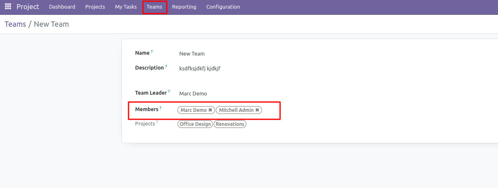
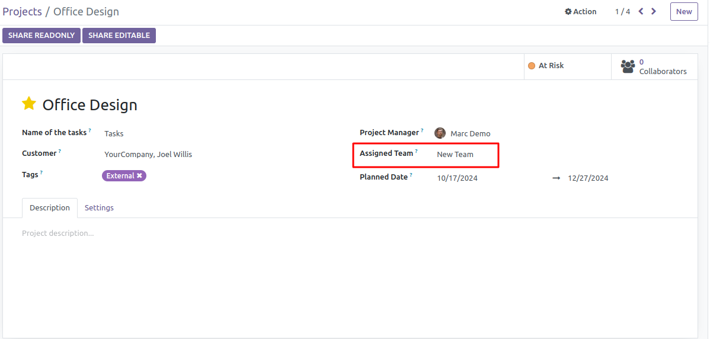
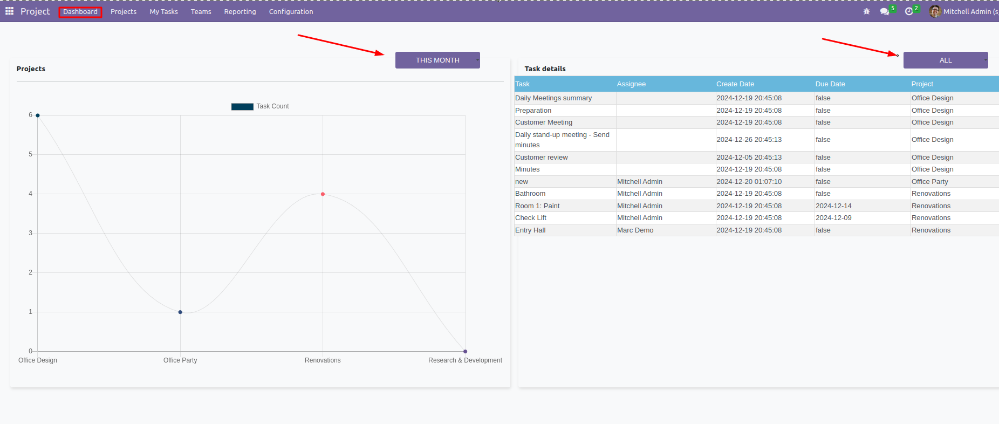

# project_strativ
Odoo project addon customization

## Feature List

- Teams: Project managers can create teams and add members to them.


- Teams association with Projects: Projects can be assigned to specific teams, making them visible only to team members.(For project module users)
 
- Project module Admins can see all projects regardless of the team.
- Dashboard: Provides an overview of project tasks and assignees with filters for period and assignee.


## Installation

### Prerequisites
- Ensure you have Odoo 16 installed. You can download it from the [official Odoo website](https://www.odoo.com/page/download).
- Ensure you have Python 3.8 or higher installed.
- Install the required Python dependencies using `pip`.
- To run odoo from scratch follow the [official Odoo installation guide](https://www.odoo.com/documentation/16.0/administration/install.html).
- or you can follow this guide written by me [Setup-development-environment-for-Odoo](https://github.com/jadiribnahasan/Setup-development-environment-for-Odoo)

### Running Odoo 16
1. Clone the Odoo 16 repository:
    ```bash
    git clone https://github.com/odoo/odoo.git --branch 16.0 --single-branch
    cd odoo
    ```

2. Install the required Python packages:
    ```bash
    pip install -r requirements.txt
    ```

3. Create a configuration file (e.g., `odoo.conf`) with the following content:
    ```ini
    [options]
    addons_path = addons,custom_addons
    db_host = False
    db_port = False
    db_user = odoo
    db_password = False
    ```

4. Start the Odoo server:
    ```bash
    ./odoo-bin -c odoo.conf
    ```

### Running the Project Extension
1. Place the `project_extension` module in the `custom_addons` directory.
2. Update the module list:
    - Go to the Apps menu.
    - Click on the `Update Apps List` button.
3. Install the `Project Extension` module from the Odoo Apps menu.
